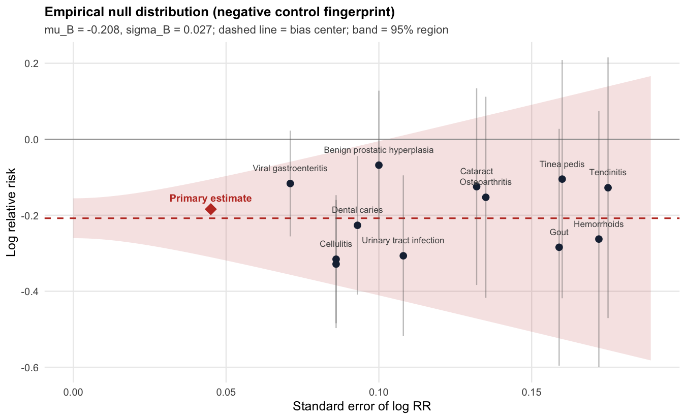
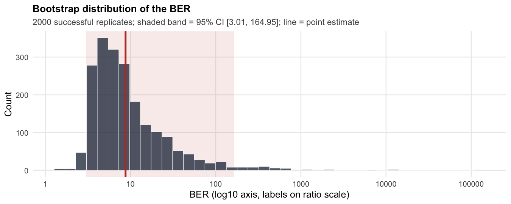

<!-- README.md is generated from README.Rmd. Please edit that file -->

# biasratio <a href="https://github.com/zengzhechun/biasratio"></a>

<!-- badges: start -->

[](https://github.com/zengzhechun/biasratio/actions/workflows/R-CMD-check.yaml)
[](https://opensource.org/licenses/MIT)
<!-- badges: end -->

**Quantify how much of your “effect” is actually bias.**

In observational studies, a statistically significant association is not
necessarily a causal one. Empirical calibration with negative control
outcomes (Schuemie et al., 2014) tells you *whether* residual systematic
bias plausibly explains your estimate, via a calibrated p-value. But a
p-value is a binary verdict dressed as a continuous number: it mixes the
*size* of the bias with the *precision* of the estimate.

The **bias-effect ratio (BER)** separates the two:

$$
\mathrm{BER} = \frac{|\mu_B|}{|\log RR_{\text{calibrated}}|}
= \frac{|\text{systematic bias}|}{|\text{effect remaining after calibration}|}
$$

- **BER \> 1** — bias is larger than the calibrated signal
  (*bias-dominated*). The “effect” is more likely an artifact than a
  fact.
- **0.5 ≤ BER ≤ 1** — bias and signal are comparable (*competitive*).
  Interpret with caution.
- **BER \< 0.5** — the calibrated signal clearly exceeds the bias
  (*effect-dominated*). The association survives the bias audit.

`biasratio` computes the BER with log-scale bootstrap confidence
intervals, classifies each estimate, runs leave-one-out sensitivity
analysis over the negative controls, and produces publication-ready
`ggplot2` visualizations designed for clinical audiences.

## Installation

``` r
# From GitHub (development version)
# install.packages("remotes")
remotes::install_github("zengzhechun/biasratio")
```

The only hard algorithmic dependency is
[`EmpiricalCalibration`](https://ohdsi.github.io/EmpiricalCalibration/)
(OHDSI), which provides the negative-control null fitting engine.

## Quick start: a bias-dominated “effect”

The package ships a fully synthetic dataset, `sim_nc` / `sim_est`, that
reproduces a classic *healthy-adherer* scenario: a drug that appears to
protect against an outcome (RR = 0.83, p \< 0.001) purely because of
systematic error. No real patient data are involved.

``` r
library(biasratio)

fit <- ber_analyze(
  logRr    = sim_est$logRr,   # primary estimate: log RR = -0.184 (RR = 0.83)
  seLogRr  = sim_est$seLogRr,
  ncLogRr  = sim_nc$logRr,    # 12 negative control outcomes
  ncSeLogRr = sim_nc$seLogRr,
  ncNames  = sim_nc$outcome,
  nBoot    = 2000, seed = 42,
  loo      = TRUE
)
fit
#> biasratio: full BER analysis
#> ========================================================
#> Empirical null:  mu_B = -0.208, sigma_B = 0.027  (K = 12 negative controls)
#> Uncalibrated:    RR = 0.832 [0.762, 0.909],  p < 0.001
#> Calibrated:      RR = 1.024,  calibrated p 0.649
#> BER = 8.73,  95% CI [3.01, 164.95]  (log bootstrap, n = 2000)
#> Classification (CI-based):  bias-dominated
#> Diagnostics: Shapiro-Wilk p = 0.637; max |std. resid| = 1.35 (Benign prostatic hyperplasia)
#> Leave-one-out: 12/12 exclusions remain bias-dominated
```

The uncalibrated estimate looks convincingly protective; the BER says
the protective appearance is about **9 times smaller than the bias
itself**.

## Reading the evidence visually

The **gauge** is the headline figure: one number, one interval, three
zones.

``` r
plot_gauge(fit)
```


The **negative-control fingerprint** shows where the bias estimate comes
from. The diamond (primary estimate) sits deep inside the bias cloud —
the visual signature of a bias-dominated association.

``` r
plot_null(fit)
```



**Before vs after calibration**: the uncalibrated CI excludes 1 (p \<
0.001); after calibration the interval straddles the null and the
calibrated p-value is 0.65.

``` r
plot_calibration(fit)
```


**Leave-one-out sensitivity**: no single negative control drives the
verdict — the BER stays in the bias-dominated zone whichever control is
excluded.

``` r
plot_loo(fit)
```


The **bootstrap distribution** quantifies uncertainty in the BER itself
(log scale; dashed line = BER = 1).

``` r
plot_boot(fit)
```



## A real-data counter-example: an effect that survives

Using the `sccs` dataset shipped with `EmpiricalCalibration` (45
negative controls; sertraline and upper GI bleeding, Schuemie et
al. 2014):

``` r
data(sccs, package = "EmpiricalCalibration")
nc <- sccs[sccs$groundTruth == 0, ]
pc <- sccs[sccs$groundTruth == 1, ]

est <- ber_estimate(pc$logRr, pc$seLogRr, nc$logRr, nc$seLogRr,
                    ncNames = nc$drugName)
est$ber
#> [1] 13.30586
ber_classify(est$ber)
#> [1] "bias-dominated"
```

## Interpretation guardrails

- BER is a **diagnostic, not a decision rule**. A bias-dominated BER
  does not prove the absence of an effect; it proves the data cannot
  separate the effect from the bias.
- The quality of the BER depends on the quality of the negative
  controls: they must share the bias structure of the primary estimate
  while being known to be unaffected by the exposure.
- Small numbers of negative controls (K \< 10) make the empirical null —
  and therefore the BER — fragile. Always inspect `plot_loo()`.

## Function map

| Task | Function |
|----|----|
| Point estimate of the BER | `ber_estimate()` |
| Bootstrap confidence interval | `ber_bootstrap()` |
| Three-zone classification | `ber_classify()` |
| Leave-one-out sensitivity | `ber_loo()` |
| Negative-control diagnostics | `ber_diagnostics()` |
| Full workflow in one call | `ber_analyze()` |
| Gauge / fingerprint / calibration / Q-Q / LOO / bootstrap plots | `plot_gauge()`, `plot_null()`, `plot_calibration()`, `plot_qq()`, `plot_loo()`, `plot_boot()` |

`bsr_*` aliases are provided for backward compatibility with earlier
analysis scripts (`bsr_estimate()` ≡ `ber_estimate()`, etc.).

## References

- Schuemie MJ, Ryan PB, Dumouchel W, Suchard MA, Madigan D. Interpreting
  observational studies: why empirical calibration is needed to correct
  p-values. *Statistics in Medicine* 33(2):209-18, 2014.
- Schuemie MJ, Hripcsak G, Ryan PB, Madigan D, Suchard MA. Empirical
  confidence interval calibration for population-level effect estimation
  studies in observational healthcare data. *PNAS* 115(11):2571-7, 2018.

## Citation

``` r
citation("biasratio")
```

## License

MIT © Zhechun Zeng
