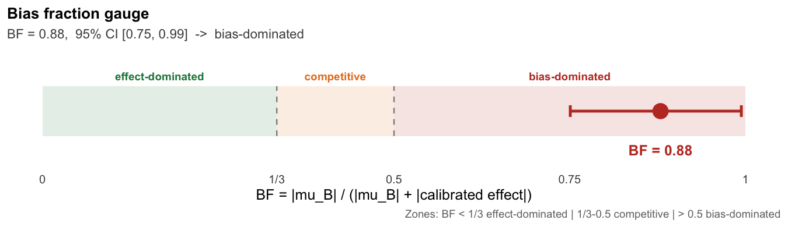
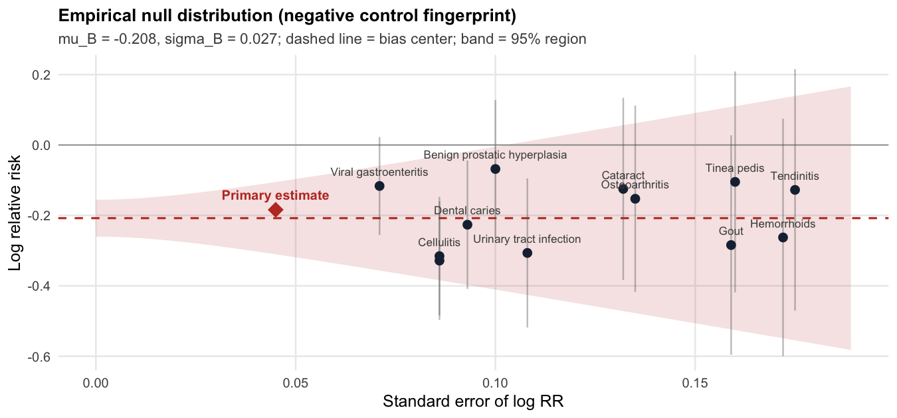
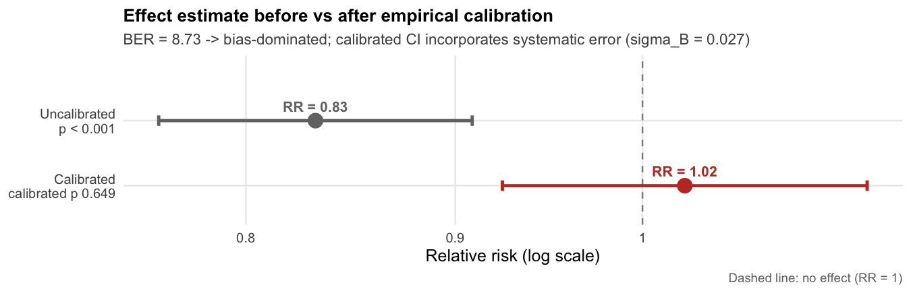
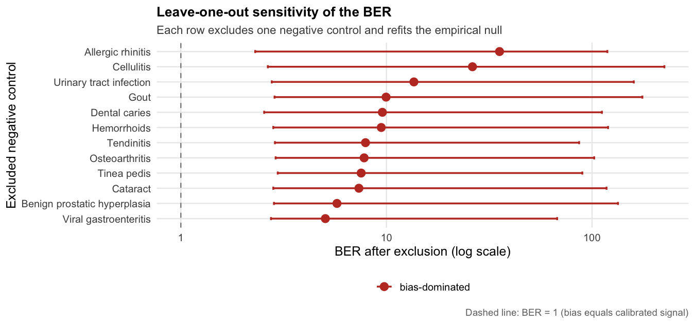

<!-- README.md is generated from README.Rmd. Please edit that file -->

# biasratio

<!-- badges: start -->

[](https://github.com/zengzhechun/biasratio/actions/workflows/R-CMD-check.yaml)
[](https://opensource.org/licenses/MIT)
<!-- badges: end -->

**Quantify how much of your “effect” is actually bias.**

In observational studies, a statistically significant association is not
necessarily a causal one. Empirical calibration with negative control
outcomes (Schuemie et al., 2014) tells you *whether* residual systematic
bias plausibly explains your estimate, via a calibrated p-value. But a
p-value is a binary verdict: it mixes the *size* of the bias with the
*precision* of the estimate, and it says nothing about the magnitude of
bias relative to the effect that survives calibration.

`biasratio` separates the two with a pair of equivalent metrics. The
primary metric is the **bias fraction (BF)**, the share of the total
calibrated signal attributable to systematic bias, on a bounded 0-1
scale:

$$
\mathrm{BF} = \frac{|\mu_B|}{|\mu_B| + |\log RR_{\text{calibrated}}|}
= \frac{|\text{systematic bias}|}{|\text{bias}| + |\text{effect remaining after calibration}|}
$$

The auxiliary **bias-effect ratio (BER)** expresses the same information
as an unbounded ratio: $\mathrm{BER} = \mathrm{BF} / (1 - \mathrm{BF})$.

-   **BF &gt; 0.5** (BER &gt; 1) — bias accounts for more than half of
    the calibrated signal (*bias-dominated*). The “effect” is more
    likely an artifact than a fact.
-   **1/3 ≤ BF ≤ 0.5** (0.5 ≤ BER ≤ 1) — bias and signal are comparable
    (*competitive*). Interpret with caution.
-   **BF &lt; 1/3** (BER &lt; 0.5) — the calibrated signal clearly
    exceeds the bias (*effect-dominated*). The association survives the
    bias audit.

`biasratio` computes BF and BER with logit-scale (equivalently
log-scale) bootstrap confidence intervals, bootstrap-median point
estimates that cannot fall outside their own CI, a Fieller confidence
set for the underlying ratio, three-zone classification, leave-one-out
sensitivity analysis over the negative controls, and publication-ready
`ggplot2` visualizations designed for clinical audiences.

## Installation

``` r
# From GitHub (development version)
# install.packages("remotes")
remotes::install_github("zengzhechun/biasratio")
```

## Quick start

The package ships a fully synthetic dataset, `sim_nc` / `sim_est`, that
reproduces a classic *healthy-adherer* scenario: a drug that appears to
protect against an outcome (RR = 0.83) purely because of systematic
error. No real patient data are involved.

``` r
library(biasratio)

fit <- ber_analyze(
  logRr    = sim_est$logRr,   # primary estimate: log RR = -0.184 (RR = 0.83)
  seLogRr  = sim_est$seLogRr,
  ncLogRr  = sim_nc$logRr,    # 12 negative control outcomes
  ncSeLogRr = sim_nc$seLogRr,
  ncNames  = sim_nc$outcome,
  nBoot = 2000, seed = 42,
  loo = TRUE
)

fit
#> biasratio: full BER analysis
#> ========================================================
#> Empirical null:  mu_B = -0.208, sigma_B = 0.027  (K = 12 negative controls)
#> BF  = 0.879  |  BER = 7.27
#> Uncalibrated:    RR = 0.832 [0.762, 0.909],  p < 0.001
#> Calibrated:      RR = 1.024,  calibrated p 0.649
#> BER = 8.73,  95% CI [3.01, 164.95]  (log bootstrap, n = 2000)
#> Classification (CI-based):  bias-dominated
#> Diagnostics: Shapiro-Wilk p = 0.637; max |std. resid| = 1.35 (Benign prostatic hyperplasia)
#> Leave-one-out: 12/12 exclusions remain bias-dominated
```

``` r
plot_bf_gauge(fit)
```



The uncalibrated estimate looks protective (RR = 0.83). Twelve negative
controls reveal a systematic protective bias ($\mu_B \approx -0.21$).
After calibration the effect vanishes (calibrated RR = 1.02, calibrated
p = 0.65), and the bias fraction is BF = 0.88 (95% CI, 0.75-0.99): bias
accounts for roughly nine tenths of the calibrated signal. Read BF near
1 as *signal saturation by bias*, not as a precise fraction.

``` r
plot_null(fit)
```



The diamond (primary estimate) sits inside the cloud of negative
controls: the visual signature of a bias-dominated association.

``` r
plot_calibration(fit)
```



``` r
plot_loo(fit$loo)
```



## What the metrics mean, in plain terms

| Question                                                    | Metric  | Scale | Read as                                                                 |
|-------------------------------------------------------------|---------|-------|-------------------------------------------------------------------------|
| Of the signal that survives calibration, how much is bias?  | **BF**  | 0-1   | bias-dominated &gt; 0.5; competitive 1/3-0.5; effect-dominated &lt; 1/3 |
| How many times larger is the bias than the residual effect? | **BER** | 0-∞   | BF/(1-BF); same three zones at 1 and 0.5                                |
| Of the *uncalibrated* association, how much is bias?        | OBF     | 0-∞   | $\|\mu_B\| / \|\log RR_{\text{obs}}\|$; descriptive companion           |

Report BF (with its CI and zone) alongside the calibrated p-value and
the calibrated RR. The calibrated p-value answers *is there evidence of
an effect after accounting for bias?* BF answers *how much of the
surviving signal is bias?* Neither is a substitute for the other.

## Main functions

| Function                                                                                                         | Purpose                                                                 |
|------------------------------------------------------------------------------------------------------------------|-------------------------------------------------------------------------|
| `ber_estimate()`                                                                                                 | fit the empirical null; BF and BER point estimates, calibrated RR and p |
| `ber_bootstrap()`                                                                                                | bootstrap CIs (log/logit scale) + bootstrap-median point estimates      |
| `ber_classify()`, `bf_classify()`                                                                                | three-zone classification (ratio / fraction scale)                      |
| `bf_fieller()`                                                                                                   | Fieller confidence set for the ratio $\mu_B / \tilde\psi$               |
| `ber_loo()`                                                                                                      | leave-one-out sensitivity over the negative controls                    |
| `ber_diagnostics()`                                                                                              | standardized residuals, Shapiro-Wilk, Q-Q data                          |
| `ber_analyze()`                                                                                                  | the whole workflow in one call                                          |
| `plot_bf_gauge()`, `plot_gauge()`, `plot_null()`, `plot_calibration()`, `plot_qq()`, `plot_loo()`, `plot_boot()` | visualizations                                                          |

## Background and assumptions

The approach rests on the OHDSI empirical calibration framework
(Schuemie et al., 2014, 2018) and on **negative control outcomes**:
outcomes that share the confounding structure of the primary endpoint
but cannot plausibly be caused by the exposure (Lipsitch et al., 2010).
The key assumption is **bias exchangeability**: the residual bias
affecting the primary estimate is drawn from the same distribution as
the biases visible in the negative controls. Like the
no-unmeasured-confounding assumption it diagnoses, bias exchangeability
cannot be verified from the data; its plausibility must be argued from
domain knowledge, and the leave-one-out and Fieller analyses probe how
far the conclusions depend on it.

Do not use the metrics when negative controls are few (&lt; 5, ideally ≥
10), non-exchangeable, or point in opposite directions, or when the
calibrated effect is near zero (BF near 1 signals saturation; the exact
value should not be over-interpreted).

## Companion paper

Zeng Z, Wang J, Zuo H, Shu L. Quantifying Systematic Bias in
Observational Causal Estimates Using Negative Controls: The Bias
Fraction. Manuscript v34 (2026). The simulation study (336 conditions,
200 repetitions each) and the MIMIC-IV case study described there
motivate the defaults used here: BF thresholds 0.5 and 1/3, logit-scale
bootstrap with bootstrap-median point estimates, and the conservative
CI-based classification rule.

## References

Schuemie MJ, Ryan PB, DuMouchel W, Suchard MA, Madigan D. Interpreting
observational studies: why empirical calibration is needed to correct
p-values. *Statistics in Medicine* 2014;33(2):209-218.

Schuemie MJ, Hripcsak G, Ryan PB, Madigan D, Suchard MA. Empirical
confidence interval calibration for population-level effect estimation
studies in observational healthcare data. *PNAS* 2018;115(11):2571-2577.

Lipsitch M, Tchetgen Tchetgen E, Cohen T. Negative controls: a tool for
detecting confounding and bias in observational studies. *Epidemiology*
2010;21(3):383-388.
